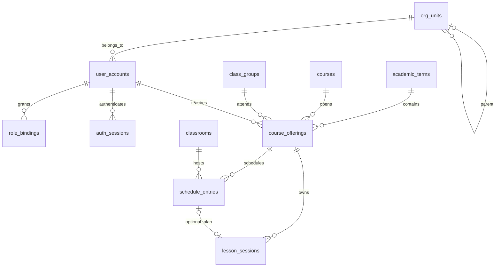
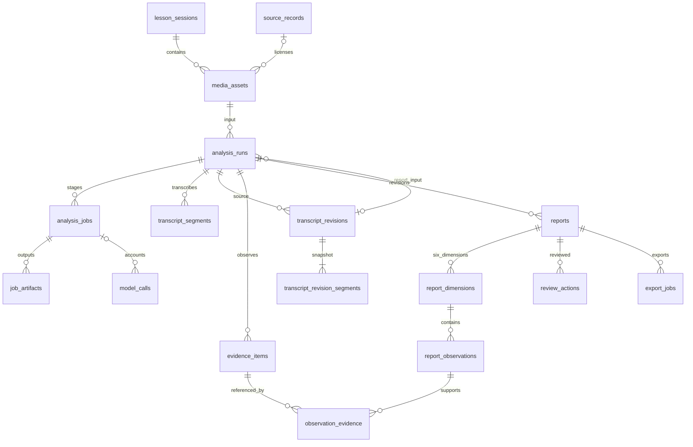

# 教学质量管理系统数据库设计

文档 v0.5，2026-10-02。目标数据库为 PostgreSQL 17 系列。结构由 [001 初始脚本](../database/001_initial_schema.sql)和 [002 迁移](../database/002_review_baseline.sql)共同定义，检查见 [check_schema.sql](../database/check_schema.sql)。新库依次执行 001、002；已有 v0.3 库仅执行 002。

## 1. 建模范围

P0 共29张表，覆盖身份、教务、媒体、任务、证据报告与治理。数据库保存业务记录和文件索引，文件字节存媒体存储。主键使用 UUID，审计流水使用 bigint identity；业务时间为 timestamptz，播放位置为整数毫秒。

外键、唯一约束和 CHECK 保证结构一致性；权限、跨行状态转换与证据语义由 Go 检查。JSONB 保存配置快照及算法元信息。数据库连接只授予 Go，迁移账号与业务账号分开。

## 2. 实体关系

### 2.1 身份与教务



开课实例固定课程、学期、教师和班级；课表对应具体日期的一次计划，最多关联一场课堂。跨周计划导入时展开为具体日期；手工场次可不关联课表。

### 2.2 分析、证据与报告



analysis_runs 固定一次分析的输入与配置，reports 保存该批次的报告修订。证据关联同时携带 run_id、session_id，禁止跨课堂或跨批次引用。模型账目可在课堂清理后解除任务关联并单独保留。

## 3. 表的职责

列名、类型、默认值和索引以 SQL 为准；本节只说明业务含义。

| 分组 | 表 | 职责与关键约束 |
| --- | --- | --- |
| 身份 | org_units、user_accounts | 组织树与账号；应用防止组织循环；有历史引用的账号使用禁用 |
| 身份 | role_bindings、auth_sessions | 固定角色及范围、会话散列与撤销；权限按项目文档执行 |
| 教务 | academic_terms、courses、class_groups、classrooms | 学期、课程、班级、教室；新建班级必填 enrollment_year，历史未知可为 NULL |
| 教务 | course_offerings、schedule_entries | 开课归属与具体排课；已有课堂后归属不可改；active 排课按教师、班级、教室分别禁止重叠 |
| 媒体 | lesson_sessions | 一行一课堂；归档保留内容，transcript_lock_version 控制转写并发修改 |
| 媒体 | source_records | 新来源绑定课堂；申请用途与核验结果分开；迁移后归属不明的记录仅管理员可处理 |
| 媒体 | media_assets | 原始与派生资产；每课堂最多一个未删除的主原媒体，parent_asset_id 关联同课堂父媒体 |
| 分析 | analysis_runs、analysis_jobs | 批次及阶段；同批次同阶段唯一，running 必须有租约，其他状态清空活动租约 |
| 分析 | job_artifacts | 同任务产物键唯一；阶段结果引用的资产须属于当前任务、租约及课堂 |
| 转写 | transcript_segments | 每批次的不可变片段，segment_no 批次内唯一 |
| 转写 | transcript_revisions、transcript_revision_segments | 完整不可变快照；人工修订带父版本、操作者和原因 |
| 证据 | evidence_items | 带时间戳的文本、帧或人工证据；被引用后内容不变，可用性可随清理更新 |
| 报告 | reports、report_dimensions | 报告版本及六维；同批次修订号唯一，每课堂最多一个 published |
| 报告 | report_observations、observation_evidence | 观察与证据多对多关联；复合外键限制同课堂、同批次 |
| 复核 | review_actions | 复核人、动作和前后变化；修正、驳回、撤回记录原因 |
| 治理 | model_calls | 预留与实际费用；call_key 唯一，unknown 保留预算，清理后保留纯账目 |
| 治理 | export_jobs、data_deletion_requests | 导出及清理状态；请求者与命名空间幂等键唯一，同键不同摘要冲突 |
| 治理 | audit_logs | 最小必要操作记录，不存凭据、完整转写或模型原文 |

## 4. 一致性与事务

### 4.1 排课与媒体

排课使用 btree_gist 和三个部分排斥约束，区间为 [start,end)，相邻时段允许，cancelled 不占用资源。教师、班级副本通过复合外键与开课实例一致。应用将 SQLSTATE 23P01 转为 SCHEDULE_CONFLICT；批量导入整批回滚，跨学院错误不透露对方详情。旧库存在重叠课表时须先处理，002 不自动删记录。

时间点查询为 starts_at ≤ at 且 ends_at > at；时间段查询为 starts_at < query_end 且 ends_at > query_start。查询不能替代数据库对并发写入的冲突裁定。

替换主媒体时锁课堂，取消旧主标记后指定 ready 新媒体；历史批次仍绑定旧资产。object_key 由存储适配器生成，拒绝用户路径和任意存储键。SQL 保证 start_ms 非负、end_ms 大于 start_ms，应用再检查原媒体时长上界和时间映射。

### 4.2 转写与报告

保存转写修订时锁课堂并检查 transcript_lock_version，插入快照头与全量片段后递增版本；课堂初始版本为0。片段须非空、编号连续、时间有效，父版本必须为同课堂同媒体的较早修订。

content_sha256 由 Go 对按 segment_no 排序、字段依次为 segment_no/start_ms/end_ms/text_content/speaker_label 的紧凑 UTF-8 JSON 数组计算，关闭 HTML 转义且不附尾换行。按同规则从落库片段重建核验，Python 无需重算。

full 不带修订输入；report_only 必须绑定同课堂、同媒体快照。input_sha256 仍为原媒体摘要，config_hash 固定 mode、修订 ID/摘要及模型配置。report_only 将快照复制为新批次片段并重建证据，provenance 记录 source_revision_id/source_segment_no。流程见[架构第4节](系统架构设计.md#4-转写证据与报告)。

模型候选暂存 job_artifacts.metadata.report_candidate，仅供 Go validate 使用；校验后才创建草稿。报告 lock_version 从1开始；更新须带版本，不匹配返回 REVISION_CONFLICT。published、superseded、withdrawn 内容只读。parent_report_id 仅关联同批次修订，跨批次历史按 session_id 查询。

发布事务先锁课堂，再检查权限、六维、复核与证据，将旧 published 改为 superseded 后发布新版本并写审计；失败整体回滚。数据库限制维度代码和每维最多一行，应用负责六维齐全、每条保留观察有证据及发布后不可改。

### 4.3 任务领取与完成

以下示例由 Go 为 Python Worker 领取媒体阶段，参数为新租约 UUID 和 worker_id；实际 stage 还须与服务凭据能力求交集。

```sql
WITH candidate AS (
    SELECT j.id
    FROM teaching.analysis_jobs j
    JOIN teaching.analysis_runs r ON r.id = j.run_id
    JOIN teaching.lesson_sessions s ON s.id = r.session_id
    WHERE j.status = 'queued'
      AND j.stage IN ('probe', 'audio_analysis', 'video_analysis')
      AND j.available_at <= now()
      AND j.attempts < j.max_attempts
      AND r.status IN ('queued', 'running')
      AND s.status NOT IN ('deleting', 'deleted')
    ORDER BY j.priority DESC, j.available_at, j.created_at
    LIMIT 1
    FOR UPDATE OF j SKIP LOCKED
)
UPDATE teaching.analysis_jobs j
SET status = 'running', attempts = j.attempts + 1,
    worker_id = $2, lease_token = $1::uuid,
    lease_expires_at = now() + interval '120 seconds',
    updated_at = now()
FROM candidate c
WHERE j.id = c.id
RETURNING j.*;
```

示例只锁任务；完成、取消和删除事务按课堂→批次→任务加锁，领取事务不反向获取课堂锁。领取提交后可条件更新批次为 running，不能覆盖取消状态。Go 后台以同样方式领取 evidence/report/validate；重试、回收和阶段依赖见[架构第5节](系统架构设计.md#5-任务阶段状态与恢复)。

完成事务先检查课堂/批次未取消或删除。任务已 succeeded 时，以 last_completed_token 和 completion_digest 识别重复确认；其他情况要求 running 且当前租约有效。首次完成保存结果与确认摘要、清空租约并创建后续任务，同事务提交。

### 4.4 预算

预算预留按账期、币种串行化，可使用事务级 advisory lock。锁内汇总实际费用和未结算预留，按固定价格版本与最大 token 预留后写 model_calls。网络调用在事务外。unknown 不释放预留；实际费用超出预留时暂停新调用并核对。

## 5. 到期与删除

期限以[项目文档第6节](../项目文档.md#6-运行安全与验收)和 [.env.example](../.env.example)为准。Go 创建报告时取默认报告期限与课堂 content_expires_at 的较早值；派生媒体不晚于父资产，导出不晚于报告期限。读取与导出均检查课堂及报告到期时间。

媒体到期后更新证据 availability，历史报告可保留文字并标注不可回看；导出仍须有 export 许可，不提供失效播放链接。归档不等于删除。

课堂清理由 data_deletion_requests 编排：

1. 锁课堂并置 deleting、撤销访问，取消任务和租约。
2. 清理并核验可控临时文件、媒体、导出和备份。
3. 同事务将所有 model_calls 的 run_id/job_id 同时置 NULL，按外键依赖删除报告、证据、转写快照、产物、任务、批次、媒体及来源。
4. 课堂置 deleted，移除原始标题等内容，保留外键所需的结构引用和最小审计事实。

修订与批次存在可延迟复合外键，清理事务使用 SET CONSTRAINTS ALL DEFERRED 后一起删除两侧。模型账目保留请求标识与金额供独立核对；unknown 的预留继续占用原账期预算，不阻塞课堂内容清除。

cleanup_manifest 记录对象和备份清理结果，仅治理模块可读；未清完的步骤保持 blocked。恢复备份前重放删除清单。模型候选与转写快照同属课堂内容，清理时一并处理。

## 6. 执行与验证

新库执行：

```powershell
psql -d teaching_test -v ON_ERROR_STOP=1 -f database/001_initial_schema.sql
psql -d teaching_test -v ON_ERROR_STOP=1 -f database/002_review_baseline.sql
psql -d teaching_test -v ON_ERROR_STOP=1 -f database/check_schema.sql
```

迁移账号需能安装 btree_gist，业务账号无建表和扩展权限。检查范围与应用验收见[开发与验收计划](开发与验收计划.md)。P1 表结构在实施相应功能时通过新迁移设计。
