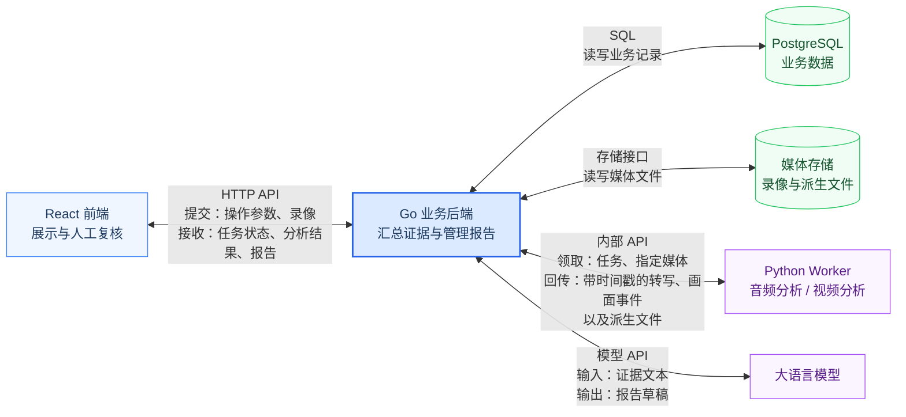

# 教学质量管理系统架构与模块设计

文档 v0.6，2026-10-03。业务范围见[项目文档](../项目文档.md)，字段见[开发协议](开发协议.md)，持久化约束见[数据库设计](数据库设计.md)。以下为待实现架构。

## 1. 总体架构

前端通过 HTTP API 提交参数和录像，接收任务状态、分析结果及报告。Go 通过 SQL 读写数据库，通过存储接口管理媒体；Worker 经内部 API 领取媒体阶段任务并返回结果。Go 汇总证据、调用报告模型，再将草稿交给前端复核。

| 模块 | 主责 | 输入与交付 |
| --- | --- | --- |
| React 前端 | 前端成员 | 用户操作 → API 请求；接口结果 → 回放、转写、证据和复核页面 |
| Go 业务后端 | 后端成员 | 请求/分析结果 → 授权、编排、证据、报告及治理 |
| PostgreSQL | 数据库成员设计，后端读写 | 业务记录 → 关联、约束、事务和查询 |
| 媒体存储 | 后端成员 | 文件字节 → 受控资产与读取接口 |
| Python Worker | 音频、视频成员 | 指定媒体 → 带时间戳的结果和派生文件 |
| 报告模型接入 | 后端成员 | 获准证据文本 → 报告候选；音视频成员协助解释证据限制 |

音频成员负责 Worker 通用通信及 ASR；视频成员负责 probe、播放代理、关键帧及后续视觉分析。后端负责共同部署和联调。P1 摄像头/MediaMTX 由后端接入、视频成员验证时间轴，录像仍进入同一资产流程。

## 2. Go 模块与依赖

Go 作为一个服务运行，模块按职责分开，通过应用接口协作；数据库表归属见数据库文档。

| 模块 | 职责 |
| --- | --- |
| identity | 登录、账号、固定角色与数据范围；唯一写账号及角色授权 |
| academic | 组织、课程、班级、开课、课表与冲突检查 |
| classroom | 课堂归属、目录、归档与生命周期 |
| media | 来源、上传、媒体元数据、授权读取与存储适配 |
| analysis | 批次、阶段、租约、重试及后续调度 |
| evidence | 转写快照、修订、时间映射与证据 |
| reporting | 模型输入与候选校验、报告修订、复核和发布 |
| governance | 预算、导出、审计和清理 |

API 先调用 identity 授权；classroom 调用 academic 校验归属；analysis 经 media/evidence/reporting 接口推进流水线；reporting 经 governance 预留和结算预算。教务账号页面也使用 identity，不能由 academic 直接改角色表。

模块可共享短事务上下文，但不得直接跨模块改表。网络模型调用和文件写入在事务外；结果保存、阶段完成和创建后续任务在同一事务内。跨模块清理由应用编排层协调，避免业务模块循环调用。

## 3. 媒体与通信

上传完成后登记 pending 原媒体，保存摘要及字节数，duration_ms 为空。来源允许 analysis 后可创建 full；仅允许 playback 时创建 media_prepare，复用同一任务表、领取及完成接口，只执行 probe 检查时长、编码和时间轴、必要时生成代理。成功后资产变为 ready，原媒体保存 playback_asset_id，课堂从 planned 变为 ready；已有归档状态不被覆盖。无主媒体时设置首个成功原媒体为主媒体，后续替换须显式选择。

浏览器回放要求媒体 ready、来源允许 playback 且用户获授权。pending 状态只展示元信息，不承诺在线预览。代理保持原始录像时间轴；无法校准返回 TIMELINE_INVALID。音轨提取只在 audio_analysis 执行，probe 仅检查音轨信息。

Worker 的媒体访问全部经过 Go 内部 API；前端、Worker 均不持有数据库或媒体存储凭据。认证、Range、错误码和字节传输见开发协议。

文件先写带课堂/任务/租约标识的随机暂存对象，记录 storage_generation；完成后锁课堂复查代次、许可、期限和租约，才原子移入正式目录并登记。清理先禁止新读写，等待已登记的在途文件句柄关闭；代次不匹配的迟到写入只能删除暂存文件，不能创建正式资产。文件与数据库没有共同事务，清理和对账都扫描正式、暂存及 Worker 临时目录；缺失 Worker 清理回执时不得标记清理成功，详见数据库第5节。

## 4. 转写、证据与报告

audio_analysis 成功后，Go 保存不可变批次片段和第一份完整转写快照；空转写不建空快照。修改时锁课堂，检查 transcript_lock_version，创建带父修订、操作者和原因的新快照，再递增版本。修改不覆盖旧报告引用的文本。

report_only 固定同课堂、同媒体的 input_transcript_revision_id，ID及内容摘要进入 config_hash。前三个媒体阶段记 skipped，evidence 将选定快照复制为新批次片段并重建证据，provenance 保留来源映射。该模式只使用选定转写，不自动复制旧画面事件；媒体失效或来源不允许分析时拒绝创建。

reporting 仅向模型发送带 evidence_id 的获准文本。超长输入按固定选择版本截断后保存 ModelInput 完整清单及实际请求摘要；清单固定最终文本、证据集合、课程上下文、模型/提示词/转写版本和真实覆盖。候选所有观察、总摘要、维度摘要的引用必须属于实际清单，不只检查同批次。候选先保存为内部任务产物，validate 通过后才成为可读草稿。P0 不外发原视频或关键帧图片；纯采样帧不被当作模型已看过的视觉证据。

报告状态按 draft → in_review → published 流转。修改 in_review 内容后回到 draft，变更观察重新标为 unreviewed。已发布、被替代和撤回版本只读，修改须复制新修订；所有写操作检查 lock_version。

发布须满足：六维齐全、受限维度有原因、无未复核观察、每条保留观察及事实摘要有同批次可用证据，且至少一条事实观察；整篇内容已经 confirm_report，摘要仍与当前 content_sha256 匹配。驳回项排除。Go 校验结构、归属和时间，人工核验语义。锁课堂后比较 expected_current_report_id，不匹配返回 REVISION_CONFLICT；匹配才替换旧当前版。撤回不恢复更早版本。媒体过期只更新证据可用性，不改历史报告内容。

## 5. 任务阶段、状态与恢复

### 5.1 阶段依赖

| 阶段 | 执行者 | 前置与输出 | 异常处理 |
| --- | --- | --- | --- |
| probe | Python 视频 | 原媒体 → 检查结果及必要代理 | 损坏或时间无效使批次 failed；无音轨跳过音频阶段 |
| audio_analysis | Python 音频 | probe 成功 → 转写、音频产物、模型信息 | 无语音或失败保留其他结果 |
| video_analysis | Python 视频 | probe 成功 → P0关键帧；P1可带行为候选 | 失败不阻止有效转写生成报告，批次 partial |
| evidence | Go evidence | 音视频均达终态，或固定修订已准备 → 同批次证据 | 无有效文本则跳过 report/validate |
| report | Go reporting | 有文本证据 → 检查许可、预留预算、调用并保存候选 | 未获准/预算不足 skipped；调用失败或计费不明 failed |
| validate | Go reporting | 已保存候选 → 校验并生成 draft | 无效候选不作为报告展示 |

只有满足依赖的阶段才创建 queued 任务。无法继续的阶段记 skipped 并说明原因；尚未创建的阶段在活动批次中显示 waiting，这是前端派生状态。完成当前阶段与创建后续阶段同事务，唯一约束防止重复创建。

P0 video_analysis 按配置定时采样，events=[]，不声称完成行为识别。full/report_only 的六阶段计划固定入批次快照；media_prepare 的 stage_plan=[probe]。时间映射、处理覆盖、执行版本严格按协议第3节固定。终态批次必须已有计划内所有阶段的终态记录，不能留下 waiting。

### 5.2 状态与重试

任务状态为 queued、running、succeeded、failed、cancelled、skipped。queued 领取后为 running；可执行阶段完成后进入终态，获准的内部重试才回 queued。Go 检查发现许可或预算不满足时可将任务置 skipped。用户重试创建新批次，不修改终态任务。

批次状态为 queued、running、succeeded、partial、failed、cancelled。输入无法处理为 failed；输入可用但分析或报告不完整为 partial；full/report_only 必需阶段完成且草稿有效为 succeeded；media_prepare 只需 probe 成功，report_id=null；用户取消为 cancelled。维度不足本身不等于阶段失败。聚合终态前不能还有可执行任务。

媒体阶段及非计费 Go 阶段最多3次尝试，退避5秒、30秒。report 每任务只调用一次，不做自动结构修复；失败后重新生成使用新批次，计费 unknown 必须先核对。

### 5.3 租约与故障恢复

Python 仅领取 probe/audio_analysis/video_analysis，并与服务凭据能力求交集；Go 后台仅领取 evidence/report/validate。两者都使用数据库租约，Go 执行者标记 go:实例ID。默认租约120秒、心跳30秒、回收15秒，具体配置见 .env.example。

Go 启动及周期扫描回收过期任务，按课堂→批次→任务加锁，比较旧 token，清空活动租约。非计费任务 attempts<max_attempts 时按5/30秒退避回 queued；最后一次过期直接 failed/JOB_TIMEOUT，跳过依赖阶段并在同事务聚合批次。每次领取固定 execution_deadline_at，心跳最多续到该截止时间，不能无限延长；超出硬期限也走同一回收流程。

report 最多1次。发送前持久化唯一 model_call 与 dispatch_started_at；标记后崩溃视为可能已发送。未打标记可释放未发送预留并失败；已打标记且无确定账单则 unknown，禁止自动重新发送。启动及周期恢复会独立扫描超过供应商超时且已无活动任务的 reserved 调用并转为 unknown，不依赖迟到回调。已有持久化候选则恢复 validate；否则任务 failed/MODEL_RESULT_UNKNOWN，保留预留。管理员经 reconcile 接口提供账单依据和版本号结算后才能创建新批次；新幂等键不能绕过同课堂未核对调用。心跳独立于模型调用，HTTP请求返回不代表后台任务结束。

完成接口先检查课堂/批次未删除或取消；任务若已 succeeded，先比较 last_completed_token 和请求摘要，相同则返回原确认，不再要求已清空的活动租约。其余提交必须匹配当前有效租约；旧token拒绝，同token不同内容冲突。具体字段见协议。

取消/清理事务先锁课堂再锁批次和任务，失效租约并停止后续调度。Worker 心跳发现取消、许可撤销、到期或断连超过租约期限即停止计算，终止子进程，删除本任务临时文件；重启先清理失效租约临时目录。已发送的模型调用仍需结算，但不得写入新报告。来源修改递增 rights_version 并使不再获准的活动任务失效；扫描也检查媒体/content_expires_at，长任务不会因领取时曾获准而持续处理。

## 6. 运行与治理

预算范围、来源许可及保留期以[项目文档第6节](../项目文档.md#6-运行安全与验收)为准；事务和物理清理见[数据库设计](数据库设计.md)。导出固定报告版本，下载时检查请求者、当前权限、用途、版本及期限；版本撤回或替代后旧下载失效。

导出/清理复用 Go 后台租约模式，存于各自任务表，不进入 Python claim。导出 queued→running→succeeded/failed/expired；过期租约重排，最多3次，最后失败写 EXPORT_FAILED。每次提交校验 token/到期/报告当前版；重复产物按任务 ID 对账。清理 requested→processing→succeeded，暂时缺少 Worker 回执或备份处置条件进入 blocked，保留阶段清单、错误及下次检查时间；条件恢复再领取。不可恢复错误或重试耗尽 failed，课堂仍 deleting、拒绝访问，管理员显式新请求接续原清理清单，并另写新的删除日志标识。清理步骤幂等，已经不存在的文件视为已完成，不能因“部分删除”回滚访问权限。

删除先写独立持久化清单并刷盘，再撤权。服务每次启动先重放清单，数据库恢复不得覆盖清单；未完成重放时 readiness=false、拒绝媒体与内容 API。清单存放及保留规则见数据库第5节，不能只保存在会随旧备份恢复的业务表中。

运行环境、联调和验收见[开发与验收计划](开发与验收计划.md)。日志关联 request_id/run_id/job_id，不记录凭据或完整课堂文本。
