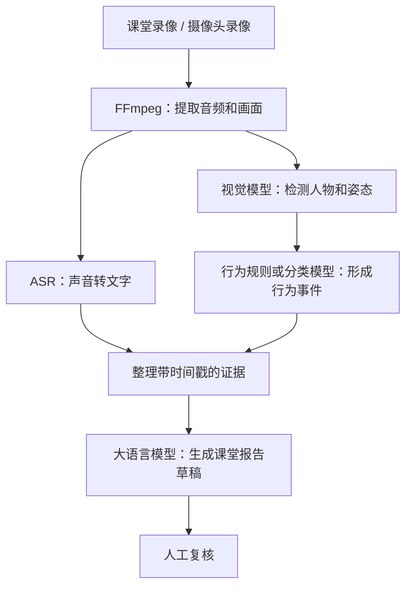

# 教学质量管理系统项目文档（vscode打开时查看时按ctrl+shift+v）
## 1. 项目概述

本项目面向学校日常教学督导和教师课堂复盘，将课表、教室、摄像头与课堂音视频关联，形成可检索、可回看、可复核的课堂记录。在授权范围内，系统通过语音转写、视觉分析和大模型生成教学观察报告，帮助教师定位课堂片段、理解改进建议，也帮助管理人员发现需要人工关注的课堂与设备问题。

项目拟参加 **2026“仓颉杯”智能编程大赛综合系统赛道**。该赛道要求可运行的软件实体、完整的角色与业务流程，以及必要的异常处理、安全和运维能力。
### 1.1 要解决的问题

| 现状 | 系统希望提供的能力 |
| --- | --- |
| 人工听课覆盖有限，录像回看耗时 | 按课表定位课堂，按时间点跳转转写和视频证据 |
| 教学评价缺少可追溯的过程依据 | 每条观察结论附证据类型、时间范围和来源 |
| 教师难以持续比较改进情况 | 在有权限的前提下查看同一教师、课程的历史报告和趋势 |
| 设备故障或采集缺失影响复盘 | 显示设备状态、采集异常和分析覆盖情况 |

## 2. 用户、权限与业务流程（前后端的同学需要看）

一个人可以有多个角色。例如，教务主任同时承担督导职责时，可以同时绑定“教务管理员”和“督导”，并分别指定权限范围。

| 角色 | 负责的工作 | 权限边界 |
| --- | --- | --- |
| 系统管理员 | 管理账号、组织、设备、存储、模型配置和运行状态 | 管理系统配置；查看课堂录像、转写和报告需要另外授予业务权限 |
| 教务管理员 | 维护课程、班级、课表、课堂基本信息 | 只能维护获授权的组织范围；教务角色本身不包含报告发布权限 |
| 教学督导 | 查看录像、转写、证据和报告，复核并发布报告，导出报告 | 只能处理获授权范围内的课堂 |
| 任课教师 | 上传本人课堂录像、提交分析、回放、纠正转写、修改和确认报告草稿 | 默认只处理本人授课课堂；正式发布由授权督导完成 |

## 3. 功能范围与交付优先级（看下各自的分工内容）

| ID | 优先级 | 需求 | 可检查的验收条件 |
| --- | --- | --- | --- |
| FR-01 | P0 | 登录、角色与组织授权 | 教师 A 无法通过直接 API 获取教师 B 的场次、媒体、证据、报告或导出 |
| FR-02 | P0 | 组织、学期、课程、班级、教师和开课实例维护 | 必填字段及唯一编码校验；已有课堂引用的记录不能被误删 |
| FR-03 | P0 | 课表导入和场次创建 | 支持全校多班级课表；同一教师或同一教室的时间冲突返回具体行和时段；原子导入失败不留下半批数据 |
| FR-04 | P0 | 离线录像上传与来源登记 | 首期以离线录像为输入；展示进度、散列、时长和检查状态；来源权限不符合用途时不能开始分析 |
| FR-05 | P0 | 浏览器回放与证据跳转 | 支持范围请求；原始或转码代理可播放；点击证据定位对应时段 |
| FR-06 | P0 | 异步分析任务 | 页面显示阶段、排队及失败原因；重启 Worker 后可以恢复过期租约任务 |
| FR-07 | P0 | 带时间戳的语音转写 | 将课堂录音转为文本，保存分段文本、起止时间和模型版本；转写不可用时显示原因 |
| FR-08 | P0 | 六维定性报告 | 输出亮点、问题、建议、限制和证据；至少一条真实事实观察可回到源片段 |
| FR-09 | P0 | 人工复核与版本发布 | 教师可纠正本人课堂的转写并修改报告草稿，修改留痕；督导发布留痕；旧版内容和证据关系仍可查询 |
| FR-10 | P0 | 有限报告导出与审计 | 仅导出授权单课堂报告；显示版本、来源和限制，排除过期媒体链接 |
| FR-11 | P0 | 配额、删除与基本运维 | 预算耗尽不再发起模型调用；删除中资源立即不可读；任务与存储状态可见 |
| FR-12 | P1 | RTSP 接入与录像分段 | 设备断流可恢复；新输入仍归属场次并沿用分析和复核流程 |
| FR-13 | P1 | 行为观察和人工纠正 | 在已标注样本上给出各类精确率/召回率；不输出未经验证的逐人身份结论 |
| FR-14 | P1 | 按教师、课程、班级的趋势 | 只统计当前发布版，显示样本量、缺失覆盖、模型版本和时间窗口 |

### 3.1 课表关联规则（FR-03）

系统面向整个学校，支持多个班级的课表同时存在。不同教师在不同教室同时上课属于正常情况；冲突检查针对同一教师或同一教室在重叠时间内被重复安排的情况。

在当前单教师、单教室的课堂设计下，教师与指定时间点可以确定其授课教室，未安排课程时为空；教室与指定时间点可以确定任课教师，未安排课程时为空闲。若查询一个时间段，应返回该时段内的课程列表。仅凭教师和教室无法唯一确定上课时间，因为同一教师可能在同一教室授课多次。

### 3.2 录像输入与转写样本（FR-04、FR-07、FR-12、FR-13）

初期使用离线录像贯通分析流程，后期接入实时录像。行为分析也可以先使用离线录像开发和验证，实时摄像头接入并非其前置条件；交付优先级仍按表中的 P0、P1 执行。

语音转写优先使用团队上课的录播作为样本，可在[山东大学学习管理系统](https://e-learning.sdu.edu.cn/portal/#/home)的课程中寻找，也可选择 MOOC 课程录像。使用前确认素材的访问与使用授权。首期重点是将课堂声音准确转为带时间戳的文本。

### 3.3 转写纠正与报告复核（FR-09）

语音转写可能存在识别错误，任课教师可以根据实际课堂内容纠正本人课堂的转写，并核对、修改报告草稿。修正应保留原文、修改内容和操作者等记录。已有报告继续关联其生成时的证据版本；需要根据修正后的转写重新生成报告时，创建新的分析批次，保留旧版内容及证据关系。正式报告由授权督导复核后发布。

## 4. 智能分析设计（音视频分析）

分析分为教师教学分析和学生课堂行为观察。教师教学分析结合音视频证据，辅助教学评价与改进；学生课堂行为观察使用视频辅助观察与统计出勤、迟到早退、举手、持续低头、离座、疑似使用手机等情况。各项能力按交付优先级逐步实现。

基本流程图：

### 4.1 六维教学观察（语音分析）
先完成语音转写
六个维度用于组织证据和复盘问题，不预设其可由模型客观“打分”。每项输出包含：观察内容、支持结论的证据、分析方法或模型版本、覆盖范围、置信或限制说明、人工复核状态。证据不足时应明确说明。

| 维度 | 可用证据示例 | 报告表达边界 |
| --- | --- | --- |
| 内容 | 转写文本、授课主题、课程信息 | 可检查主题相关片段；知识正确性需人工核验 |
| 节奏 | 讲话时段、停顿、互动和环节切换 | 仅描述时间分布，不以单一节奏模板评判所有课程 |
| 思维 | 提问、追问、学生回应片段 | “启发性”等判断需有具体对话支持，不能仅数关键词 |
| 表达 | 语音清晰度、语速、板书或课件可见性 | 音视频质量差时显示限制，不推断教师能力 |
| 管理 | 课堂互动、明显秩序事件、出勤记录 | 行为识别仅作线索，须由授权人员复核 |
| 技术 | 课件、板书、设备使用及故障记录 | 区分教学选择与设备异常 |

### 4.2 行为观察与效果验证（视觉分析）

视频观察仅在授权、视角和清晰度足够时作为辅助。举手、低头、离座、疑似使用手机等检测结果记录类别、时间区间、置信度、模型版本和可回看片段。

## 5. 系统设计草案

### 5.1 模块与技术选型

| 层次 | 拟采用技术 | 职责 |
| --- | --- | --- |
| 前端 | React | 课堂、课表、设备管理，视频回放、报告复核和统计 |
| 后端 | Go、Python | 身份与权限、基础资料、课堂场次、任务编排、报告与审计 |
| 数据存储 | PostgreSQL、本地文件；可选 MinIO | 结构化业务数据、证据索引及授权媒体文件 |
| 分析服务 | Python、FFmpeg、ASR、大模型 | 音频处理、转写、证据汇总 |
| 视觉能力 | OpenCV、YOLOX、RTMPose、ONNX Runtime | 按实际验证结果选择和接入 |
| 实时流 | MediaMTX | 需要实时视频时提供转发和状态监测 |

技术栈均为候选方案，具体依赖与版本应在代码落地后固定。

大赛不强制使用仓颉语言，但通知鼓励在核心模块或创新功能中使用，并可能按使用与理解深度给予额外加分。

### 5.2 核心数据与关联(数据库和后端)

| 实体 | 必要关联或字段 | 用途 |
| --- | --- | --- |
| 用户与角色 | 用户、角色、组织范围 | 访问控制与操作归属 |
| 课表与课堂场次 | 课程、班级、教师、教室、计划及实际起止时间 | 将业务信息与音视频对应 |
| 设备与媒体 | 教室、设备状态、流地址或对象键、采集时间 | 接入、回放和故障定位 |
| 分析任务 | 场次、任务类型、状态、重试次数、模型版本 | 记录对某节课执行的处理及其状态，用于进度展示和故障恢复 |
| 证据 | 场次、媒体时间区间、转写片段或关键帧、来源、置信度 | 将报告结论关联到具体课堂片段，支持回放核验和人工复核 |
| 报告与复核 | 场次、维度、证据 ID、草稿/确认状态、修订历史 | 结论追溯和版本管理 |
| 审计记录 | 操作者、动作、对象、时间、结果 | 权限核查与导出追踪 |

## 6. 运行、安全与验收

### 6.1 异常和降级

| 场景 | 预期处理 |
| --- | --- |
| 摄像头离线或录像缺失 | 显示采集失败及影响时段；允许有权限人员上传已授权录像，不生成虚构分析 |
| 音频不可用或质量差 | 跳过依赖语音的维度，标记覆盖不足；仍可查看录像和其他有效证据 |
| AI 服务超时或额度不足 | 任务失败并显示原因；可重试，已有证据和人工记录仍可访问 |
| 视频与转写时间不齐 | 标记时间校准问题，暂停不可靠的跳转证据，允许重新校准后再分析 |
| 用户越权或导出失败 | 拒绝访问并留审计记录；导出任务状态可查询，不暴露其他用户数据 |
